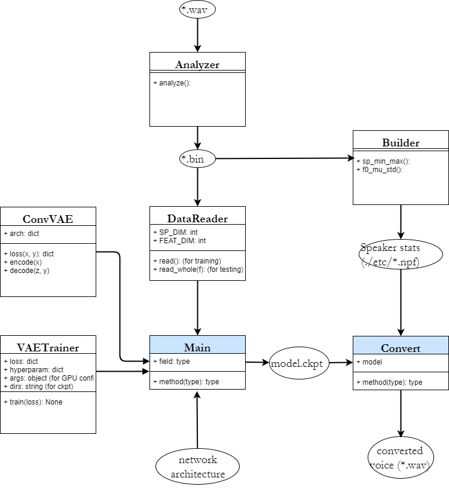

Open-sourced version of our papers:
1. [Voice Conversion from Non-parallel Corpora Using Variational Auto-encoder](https://arxiv.org/abs/1610.04019).  
2. [Voice Conversion from Unaligned Corpora using Variational Autoencoding Wasserstein Generative Adversarial Networks](https://arxiv.org/abs/1704.00849)  

These scripts extract features, train the model, and convert the voice for you.  
See the note section for difference between this repo and the the paper.

# Dependency
- Ubuntu 16.04  
- Python 3.6 
  - Tensorflow-gpu 1.5.0
  - PyWorld
  - librosa
  - soundfile
<br/>


### Note:
1. Be sure to use create a virtual environment (using `conda` or `virtualenv`)
2. If your Tensorflow is the CPU version, you might have to replace all the `NCHW` ops in my code because Tensorflow-CPU only supports `NHWC` op and will report an error: `InvalidArgumentError (see above for traceback): Conv2DCustomBackpropInputOp only supports NHWC.`
3. `soundfile` might require `sudo apt-get install` some codecs.  
<br/>
<br/>


# Usage
```bash
# source activate [your env]

bash download.sh

# install the required packages
pip install -r requirements.txt

# feature extraction
python analyzer.py \
--dir_to_wav dataset/vcc2016/wav \
--dir_to_bin dataset/vcc2016/bin 

# collect stats
python build.py \
--train_file_pattern "dataset/vcc2016/bin/Training Set/*/*.bin" \
--corpus_name vcc2016

# training
python main-vawgan.py --corpus_name vcc2016

# conversion
python convert-vawgan.py \
--corpus_name vcc2016 \
--src SF1 \
--trg TM3 \
--module model.vawgan \
--model VAWGAN \
--checkpoint logdir/train/[timestampe]/model.ckpt-[modelid] \ 
--file_pattern "./dataset/vcc2016/bin/Testing Set/{}/*.bin"
# Just an example; Please fill in `timestampe` and `model id`.
```

Description:  
1. Run `bash download.sh` to prepare the VCC2016 dataset.  
2. Run `analyzer.py` to extract features and write features into binary files. (This takes a few minutes.)  
3. Run `build.py` to collect stats, such as spectral extrema and pitch.  
4. To train a VAE or VAWGAN, for example, run  
5. You can find your models in `./logdir/train/[timestamp]`  
6. To convert the voice, run  
7. You can find the converted wav files in `./logdir/output/[timestamp]`  
8. The VAE in `model.vae` supports multiple speaker training while that in `model.vawgan` does not.
   The VAE can be trained and used with the following snippets:

<br/>


# Dataset
Voice Conversion Challenge 2016 (VCC2016): [download page](https://datashare.is.ed.ac.uk/handle/10283/2211)  
<br/>

# Model  
 - [x] Conditional VAE
 - [x] Conditional VAWGAN
<br/>
<br/>


# Folder Hierarchy
You only have to specify the model architecture (`architecture-vawgan-vcc2016.json`),
and prepare the audio files in the following structure:
```
dataset
  vcc2016
    wav
      Training Set
      Testing Set
        SF1
        SF2
        ...
        TM3
```  
The speaker list will be built up automatically during training.  
<br/>


# Binary data format
The [WORLD vocdoer](https://github.com/mmorise/World) features and the speaker label are stored in binary format.  
Format:  
```
[[s1, s2, ..., s513, a1, ..., a513, f0, en, spk],
 [s1, s2, ..., s513, a1, ..., a513, f0, en, spk],
 ...,
 [s1, s2, ..., s513, a1, ..., a513, f0, en, spk]]
```
where   
`s_i` is (energy-normalized) spectral envelop magnitude (in log10) of the ith frequency bin,  
`a_i` is the corresponding "aperiodicity" feature,   
`f0` is the pitch (0 for unvoice frames),  
`en` is the energy,  
`spk` is the speaker index (0 - 9) and `s` is the `sp`.

Note:
  - The speaker identity `spk` was stored in `np.float32` but will be converted into `tf.int64` by the `reader` in `analysizer.py`.
  - I shouldn't have stored the speaker identity per frame;
    it was just for implementation simplicity. 

<br/>

# Modification Tips
1. Define a new model (and an accompanying trainer) and then specify the `--model` and `--trainer` of `main.py`.  
2. Tip: when creating a new trainer, override `_optimize()` and the main loop in `train()`.
3. Code orgainzation

   
This isn't a UML; rather, the arrows indicates input-output relations only.

<br/>

# Difference from the original paper
1. [WORLD vocoder](https://github.com/mmorise/World) (or [pyworld](https://github.com/JeremyCCHsu/Python-Wrapper-for-World-Vocoder) in this repo) is chosen in this repo instead of [STRAIGHT](http://www.wakayama-u.ac.jp/~kawahara/STRAIGHTadv/index_e.html) 
   because the former is open-sourced whereas the latter isn't.
   However, there will be a certain degree of performance degradation.  
2. Global variance post-filtering was not included in this repo.  
3. In our VAE-NPVC paper, we didn't apply the [-1, 1] normalization; we did in our VAWGAN-NPVC paper.
<br/>


### Note on the VAWGAN script
1. It can only do **1-to-1 VC**. (cf. the VAE code (`master` branch) can do multiple speaker VC)  
2. During training VAWGAN, 
   the resulting model of the VAE part (as a by-product) is also stored 
   (in `logdir/train/[timestamp]/VAE`).  
3. Setting `epoch_vawgan` in `architecture-vawgan-vcc2016.json` to 0 results in 1-to-1 VAE.  
<br/>


# About
My original code VAE base was originally built in March, 2016.  
Tensorflow was in version 0.10 or earlier, so I decided to refactor my code and put it in this repo.
